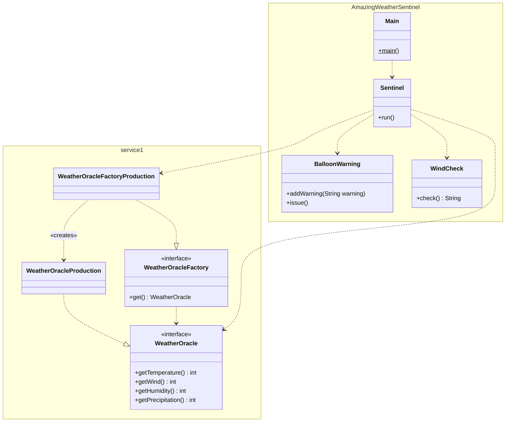
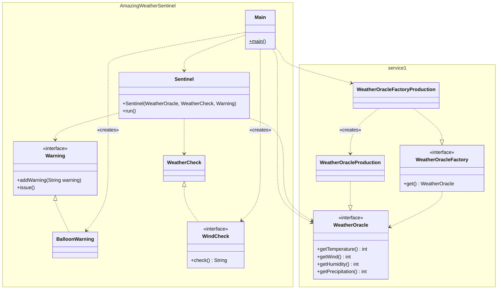

1. Single Responsibility  
   Klassen ableiten

2. Dependency Inversion  
   Im nächsten Schritt werden die Dependencies ausgetauscht umgekehrt; die dependencies werde von der Main-Methode
   zusammengefügt. Das lässt sich jetzt auch unittesten.

3. Open-Closed
Wir erstellen eine neue Klasse WeatherRules mit Schnittstelle
