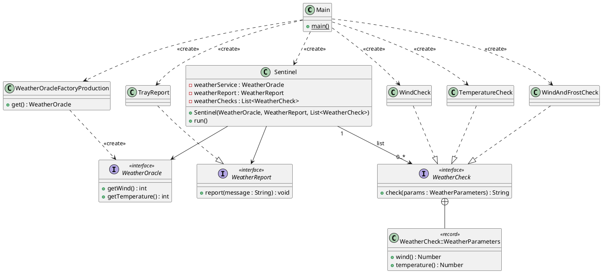

## Das Open Closed Principle

Nach der Dekomposition mittels Anwendung des SRP und der Dependency Inversion sind Sie nun bereit, den Wetterdienst
`WeatherOracle`, dessen Lizenz ausgelaufen ist, durch den neuen, durch günstige Akquise dem Firmenbesitz von Elon Bezos
hinzugefügten PalantAir-Wetterdienst zu ersetzen. Doch es kommt so oft anders als geplant:

Gerade wollten Sie mit der Implementierung beginnen, da kommt Elon Bezos höchstselbst an Ihrem Tisch in der
Abstellkammer vorbei und wütet, dass trotz des Amazing Weather Sentinels immer noch Flüge verschoben werden müssten.
Ursache seien Probleme mit der Außentemperatur. Sobald diese 30 Grad Celsius übersteige, begännen sich einige
Komponenten der Raumschiffhülle bei Belastung so stark zu verformen, dass das Schiff nicht stabil gehalten werden könne.
Daher müsse der AWS nun unbedingt eine Wetterwarnung bei Temperaturen über 30 Grad Celsius ausgeben.
Außerdem hätte Claus Bezos gewarnt, dass auch laue Lüftchen über 30 km/h gefährlich sein könnten, allerdings nur bei
Temperaturen unter dem Gefrierpunkt. Auch in dem Fall soll eine Warnung gemeldet werden.
Sie sollen sich nicht nur mit höchster, sondern mit allerhöchster Priorität darum kümmern, dass der Amazing Weather
Sentinel ertüchtigt wird, diese Warnungen zu liefern, andernfalls drohe eine Beschimpfung, da man Ihnen das Gehalt ja
nicht mehr kürzen könne, da Sie bereits unter Mindestlohn arbeiten.

Was ist hier also zu tun? Prinzipiell ist die bis dato einzige Wetterprüfung im `WindCheck` implementiert, dank SRP.
Vielleicht könnte man diese Prüfung einfach erweitern? Dazu müsste man natürlich die `check`-Methode aufbohren, da
allerwenigstens die Temperatur vorhanden sein müsste.
Im Ergebnis sähe das so aus: Die Schnittstelle `WeatherCheck` muss angepasst werden, so dass die Methode `check` sowohl
Wind als auch Temperatur empfängt.
Die Implementierung `WindCheck` müsste ebenfalls entsprechend angepasst werden: Schnittstellenmethode, interne
Delegatemethode, falls man die weiter nutzen wollte, und natürlich die Prüflogik. Diese könnte aus einer `ElseIf`-Kette
bestehen, die die einzelnen Prüfungen durchführt und entweder eine Warnung oder eben keine Warnung ausgibt.

```java
public interface WeatherCheck {
  String check( Number wind, Number temperature );
}

public class WindCheck implements WeatherCheck {
  private static final Logger log = LoggerFactory.getLogger( MethodHandles.lookup( ).lookupClass( ) );

  @Override
  public String check( Number wind, Number temperature ) {
    return checkWeather( wind.intValue( ), temperature.intValue( ) );
  }

  private String checkWeather( int wind, int temperature ) {
    String result;
    if( wind > 40 ) {
      result = "Wind warning: %d km/h".formatted( wind );
    } else if( temperature > 30 ) {
      result = "Temperature warning: %d °C".formatted( temperature );
    } else if( wind > 30 && temperature < 0 ) {
      result = "Wind/Temperature warning: %d km/h at %d °C".formatted( wind, temperature );
    } else {
      result = "All parameters within limits: Wind %d km/h, Temperature %d °C";
    }
    log.info( result );
    return result;
  }
}
```

Warum ist das kein guter Ansatz?

1. Trivialgrund, aber nicht unbedeutsam: Die Implementierung heißt `WindCheck`. Es ist unerwartet, dass diese dann mit
   der Temperatur arbeitet. Der Name ist nicht beschreibend.
2. Die Schnittstelle `WeatherCheck` musste aufgebohrt werden. Das ist immer eine schlechte Idee, da mit einer Änderung
   der Schnittstelle plötzlich alle Implementierungen fehlerhaft werden und einer Anpassung bedürfen. Bei öffentlichen
   APIs sind Schnittstellenänderungen gar nicht erlaubt. Das wäre eine sogenannte inkompatible Änderung, da sie
   inkompatibel zu ihren Abhängigkeiten geändert werden würde. Diese müssten nicht nur Ihre Realisierung der
   Schnittstelle und ggf. die Implementierung selbst, sondern auch die vorhandenen Unittests anpassen.
3. Die Logik der Klasse hat sich geändert. Das hat Auswirkungen auf ihren Vertrag, also ihr Versprechen, was sie kann.
   Das hat zwei Effekte:
    1. Eventuelle Nutzer wären ggf. überrascht von der Temperaturwarnung; natürlich wären die eh schon stutzig geworden,
       weil Punkt 2 viel stärker zuschlägt.
    2. Die Unittests der Klasse, sofern vorhanden, müssten angepasst werden, da sich die Klasse nun anders verhält und
       damit Assertions obsolet sein könnten. Im spezifischen Fall wären die Unittests sogar syntaktisch zerstört
       worden.
4. Zukunftssicherheit. Die ist überhaupt nicht gegeben. Wenn Elon Bezos als nächstes mit einem Wunsch um die Ecke kommt,
   die Luftfeuchtigkeit zu berücksichtigen, beginnt dasselbe Spiel von vorn.

Insgesamt sind dies Auswirkungen, die durch den Verstoß gegen das Open Closed-Prinzip erzeugt worden sind. Und das
schauen wir uns jetzt an, bevor wir im Anschluss eine sichere Lösung für den Weltraummilliardär erstellen.

Die Kernaussage des Open Closed Principles ist:
**Ein Modul (z.B. eine Klasse) sollte offen sein für Erweiterungen, aber verschlossen gegenüber Modifikationen.**
Der Grundgedanke dahinter ist, dass ein Modul zwar um neue Funktionen und Features erweiterbar sein soll, aber eben
genau so, dass bei einer Erweiterung bereits vorhandene Funktionalität (und daraus folgend auch abhängige Module wie
Unittests und Verwendermodule) nicht angepasst werden muss. Sobald ein Modul fertiggestellt und getestet ist, sollte es
nicht mehr verändert werden müssen, um ein neues Feature zu implementieren. Stattdessen sollten neue Anforderungen in
neuen Klassen implementiert werden, die dann an das vorhandene System angeschlossen werden, möglichst natürlich über
Abstraktionen. Das hilft beim Reduzieren der zyklomatischen Komplexität (also der Pfade durch den Code eines Moduls,
auch Branches genannt), führt zu kleineren Codeartefakten und schützt damit vor Regressionsfehlern.

Um die neuen Anforderungen von Elon Bezos umzusetzen, wäre es nach Lehrbuch also grundsätzlich die beste Vorgehensweise,
wenn das vorhandene Modul `WindCheck` und die zugehörige Schnittstelle `WeatherCheck` unangetastet blieben. Das ist hier
allerdings nicht nötig, da es keine Verwender für die Schnittstelle und auch nicht für die Implementierung gibt außer
unseres eigenen Programms; das wissen wir mit Sicherheit. Deshalb ist es unnötig, eine neue Schnittstelle zu definieren.
Eine Anpassung des Sentinel-Unittests benötigen wir sowieso, ob mit neuer oder geänderter Schnittstelle.
Das ist auch nicht unser Fehler, denn um den Code OCP-konform zu machen, müssen wir ihn anpassen. Die Anpassung an das
OCP ist mit Sicherheit kein Verstoß gegen das OCP. Es ist eine Investition in die Zukunftssicherheit der Applikation.

Wie gehen wir nun vor? Das dürfen Sie zunächst selbst überlegen.

### Aufgabe

Sie kennen die Anforderungen des Milliardärs bereits. Versuchen Sie zunächst, die vorhandene Codebase (Version 3) des
Amazing Weather Sentinels so anzupassen, dass die spätere Implementierung dieser Anforderung nur durch die Erstellung
weiterer Klassen erreicht werden kann. Nutzen Sie dabei das bereits erlangte Wissen über das Single Responsibility- und
das Dependency Inversion-Prinzip.
Wenn die Codebase vorbereitet ist, implementieren Sie die beiden neuen Wetterprüfungen. Zur Erinnerung: Eine
Wetterwarnung soll zusätzlich zur bereits bestehenden Windwarnung auch dann erfolgen, wenn die Temperatur 30 Grad
Celsius übersteigt, oder wenn sie unter den Gefrierpunkt von 0 Grad liegt und eine Windgeschwindigkeit von 30 km/h
vorhergesagt wird.

### Lösungsvorschlag

Da wir wissen, dass es die Anforderung nach neuen Prüfungen gibt, ist der erste Schritt die Änderung des `WeatherCheck`
-Interfaces; schließlich ist es nur logisch, dass neue Anforderungen an Wetterprüfungen mittels einer neuen
Implementierung der bereits vorhandenen Schnittstelle abgebildet werden. Die Schnittstelle bietet aber noch nicht alle
Daten, die wir benötigen werden (einmal Temperatur und einmal Temperatur und Wind). Der Rückgabetyp `String`, der das
Prüfergebnis propagieren soll, ist zunächst ausreichend.
Es muss also ein Weg gefunden werden, verschiedene Parameter generisch zu übergeben. Der Wunsch sollte es sein, dass die
Schnittstelle nach dieser Anpassung nie wieder angepasst werden muss. In der Praxis (und unabhängig von der
Programmiersprache) löst man eine solche Anforderung meist mit einem Parameterobjekt, das die einzelnen, gewollten
Parameter bündelt. Gewollt ist aktuell noch der Parameter `Wind` vom Typ `Number`, aber aufgrund der Neuanforderungen
soll noch der Parameter `Temperature` vom Typ `Number` hinzukommen. Würden die Parameter einfach in der Definition der
Schnittstellenmethode aufgelistet, würde mit jedem neuen Parameter die Schnittstelle aufgebohrt werden müssen.
Deshalb definiert man eine Klasse zum Transport der Parameter in die Schnittstellenimplementierungen. Der Vorteil daran
ist, dass diese Klasse jederzeit um weitere Attribute (also Parameter) erweitert werden kann, ohne dass dies Einfluss
auf die Schnittstellen hat, denn die bekommt lediglich eine Instanz der Wrapperklasse übergeben, als sogenanntes
Parameterobjekt.
Die Umsetzung der Wrapperklasse könnte so aussehen:

```java
public final class WeatherParameters {
  private final Number wind;
  private final Number temperature;

  public WeatherParameters( Number wind, Number temperature ) {
    this.wind = wind;
    this.temperature = temperature;
  }

  public Number wind( ) {
    return wind;
  }

  public Number temperature( ) {
    return temperature;
  }
}
```

Seit Java 16 gibt es die sogenannten Records, die für genau solche Fälle erstellt worden sind. Sie bieten genau die
Funktionalität, die die Klasse oben bietet, aber mit nur einer Zeile Code. Attribute, Getter und einige Standardmethoden
wie `equals()` und `hash()` bekommt man geschenkt, ohne eine einzige Zeile Boilerplatecode.

```java
public record WeatherParameters( Number wind, Number temperature ) { }
```

Den Transporttyp `WeatherParameters` kann man direkt in der `WeatherCheck`-Schnittstelle definieren, da er allein für
die Verwendung in der Schnittstelle selbst definiert worden ist. Das ist tatsächlich sehr guter Stil. Die sich daraus
ergebende enge Kopplung ist absolut gewollt und eine Abstraktion, falls Sie an diese denken sollten, wäre überhaupt
nicht notwendig.
Ändern wir also die Schnittstelle `WeatherCheck` entsprechend ab:

```java
public interface WeatherCheck {
  record WeatherParameters( Number wind, Number temperature ) { }

  String check( WeatherParameters weatherParameters );
}
```

Die Änderung führt zu Fehlern in der Implementierung `WindCheck`, der folglich angepasst werden muss. Das ist trivial
und erfolgt daher kommentarlos:

```java
public class WindCheck implements WeatherCheck {
  private static final Logger log = LoggerFactory.getLogger( MethodHandles.lookup( ).lookupClass( ) );

  @Override
  public String check( WeatherParameters weatherParameters ) {
    log.info( "Wind check" );
    return checkWind( weatherParameters.wind( ).intValue( ) );
  }

  private String checkWind( int wind ) {
    String result;
    if( wind > 40 ) {
      result = "Wind warning: %d km/h".formatted( wind );
    } else {
      result = "Wind within limits: %d km/h".formatted( wind );
    }
    log.info( result );
    return result;
  }
}
```

Als nächstes in der Reihe sollte der Sentinel korrigiert werden, denn die Änderungen am `WeatherCheck`-Interface haben
natürlich Auswirkungen auf den Aufrufer.

1. Die Windprüfung empfängt nicht mehr nur einen Windwert, sondern ein komplexes Objekt vom Typ `WeatherParameters`, das
   aktuell Wind und Temperatur enthält. Die Schnittstelle muss selbstverständlich entsprechend versorgt werden und dafür
   muss das `WeatherParameters`-Objekt zunächst einmal aufgebaut werden.
2. Der Sentinel soll mehrere Prüfungen ausführen. Dazu muss er zunächst in der Lage sein, mehrere Implementierungen der
   `WeatherChecks` zu empfangen. Für diesen Zweck reicht uns eine Liste vollkommen aus. Der Constructor muss
   entsprechend angepasst werden, dass er nun eine Liste mit `WeatherChecks` anstelle eines einzelnen `WeatherChecks`
   empfangen kann. Zusätzlich muss auch Platz in den Attributen für diese Liste geschaffen werden. Das alte Attribut für
   das Vorhalten des einzelnen `WeatherCheck`s wird dagegen nicht mehr gebraucht und kann weg.
3. Das Protokoll ändert sich natürlich auch, denn statt des Aufrufs eines einzelnen `WeatherChecks` muss jetzt die Liste
   aller `WeatherChecks` iteriert und jede Wetterprüfung für sich ausgeführt werden. Die Ergebnisse jeder Prüfung, also
   die Nachrichten, müssen verknüpft werden, um das Benachrichtigungsmodul `WeatherReport` zu versorgen. Da die Ausgabe
   ein Detail ist, das hier nicht im Fokus steht, reicht es aus, die Meldungen zu konkatenieren und mit einem
   Zeilenumbruch zu trennen.

Die Klasse sieht nach den Codeänderungen wie folgt aus:

```java
public class Sentinel {
  private static final Logger log = LoggerFactory.getLogger( MethodHandles.lookup( ).lookupClass( ) );
  private final WeatherOracle weatherService;
  private final WeatherReport weatherReport;
  private final List<WeatherCheck> weatherChecks;

  public Sentinel( WeatherOracle weatherService, WeatherReport weatherReport, List<WeatherCheck> weatherChecks ) {
    this.weatherService = weatherService;
    this.weatherReport = weatherReport;
    this.weatherChecks = weatherChecks;
  }

  public void run( ) {
    log.debug( "Creating Weather Report" );
    var weather = new WeatherCheck.WeatherParameters(
      weatherService.getWind( ),
      weatherService.getTemperature( ) );
    var message = executeWeatherChecks( weather );
    weatherReport.report( message );
  }

  private String executeWeatherChecks( WeatherCheck.WeatherParameters weather ) {
    List<String> results = new LinkedList<>( );
    for( var wc : weatherChecks ) {
      var checkResult = wc.check( weather );
      results.add( checkResult );
    }
    return String.join( System.lineSeparator( ), results );
  }
}
```

Bleibt noch Composition Root, bzw. die Main-Klasse. Diese muss natürlich eine Liste von `WeatherCheck`s definieren, die
der Sentinel dann einzeln ausführen soll, anstelle des einzelnen `WindCheck`s zuvor.

```java
public class Main {
  private static final Logger log = LoggerFactory.getLogger( MethodHandles.lookup( ).lookupClass( ) );

  static void main( ) {
    log.info( "Starting Amazing Weather Sentinel" );
    var sentinel = new Sentinel(
      new WeatherOracleFactoryProduction( ).get( ),
      new TrayReport( ),
      List.of( new WindCheck( ) ) );
    sentinel.run( );
  }
}
```

Damit ist der Amazing Weather Sentinel wieder lauf- und funktionsfähig (mit Ausnahme des Unittests, der bald korrigiert
wird), aber weitaus flexibler, wenn es um die Erweiterung der Funktionalität geht. Per Design wird nun nahegelegt, dass
neue Wetterprüfungen nicht in vorhandene hineinmodifiziert, sondern als eigenes, separates Modul (Klasse) eingeführt
werden. Und damit sind wir genau bei der Kernaussage des Open-Closed-Prinzips angekommen. Der Amazing Weather Sentinel
ist offen für Erweiterungen und verschlossen für Veränderungen. Letzteres ist natürlich nur auf einer Metaebene gegeben,
könnte aber durch Auslagerung des Sentinels in ein eigenes Modul auch "physisch" erreicht werden, denn dann läge die
Implementierung der Sentinel-Klasse nicht mehr in unserer Einflusssphäre. So bleibt es bei einer vom Design angedeuteten
Vorgabe.

Implementieren wir also die neuen Anforderungen, nach denen Elon Bezos verlangt.

Zuerst der Temperaturcheck:

```java
public class TemperatureCheck implements WeatherCheck {
  private static final Logger log = LoggerFactory.getLogger( MethodHandles.lookup( ).lookupClass( ) );

  @Override
  public String check( WeatherParameters weatherParameters ) {
    log.info( "Temperature check" );

    String result;
    final var temp = weatherParameters.temperature( ).intValue( );

    if( temp > 30 )
      result = "Temperature warning: %d °C".formatted( temp );
    else
      return "Temperature within limits: %d °C".formatted( temp );

    log.info( result );
    return result;
  }
}
```

Und dann die Prüfung auf "frostigen Wind":

```java
public class WindAndFrostCheck implements WeatherCheck {
  private static final Logger log = LoggerFactory.getLogger( MethodHandles.lookup( ).lookupClass( ) );

  @Override
  public String check( WeatherParameters weatherParameters ) {
    log.info( "Wind/Frost check" );

    final var wind = weatherParameters.wind( ).intValue( );
    final var temp = weatherParameters.temperature( ).intValue( );
    String result;

    if( wind > 30 && temp < 0 ) {
      result = "Wind/Frost warning: %d km/h and %d °C ".formatted( wind, temp );
    } else {
      result = "Wind/Frost indicators within limits: %d km/h and %d °C ".formatted( wind, temp );
    }
    log.info( result );

    return result;
  }
}
```

Die neuen Implementierungen an sich ändern nichts am Programmablauf, das Programm ist also während der
Implementierungsphase tatsächlich verschlossen. Bei einer direkten Einbindung in vorhandenen Code würde man mit
potenziellen Seiteneffekten oder konkurrierenden Änderungen zu kämpfen haben. Letzteres führt eventuell zu
Mergekonflikten im Git, oder echten Sperren in anderen Programmiersprachen (ABAP ist da ein Kandidat). Man kann die
neuen Features also perfekt unabhängig testen und nach erfolgreicher Probe in den Amazing Weather Sentinel
einbinden. Das passiert natürlich in Composition Root beim Erstellen der Liste der Wetterprüfungen.

```java
public class Main {
  private static final Logger log = LoggerFactory.getLogger( MethodHandles.lookup( ).lookupClass( ) );

  static void main( ) {
    log.info( "Starting Amazing Weather Sentinel" );
    var sentinel = new Sentinel(
      new WeatherOracleFactoryProduction( ).get( ),
      new TrayReport( ),
      List.of( new WindCheck( ), new TemperatureCheck( ), new WindAndFrostCheck( ) ) );
    sentinel.run( );
  }
}
```

Die Umsetzung von Elon Bezos neuester Anforderung ist damit abgeschlossen ... bis auf die weiter oben erwähnte
Notwendigkeit zur Anpassung des Sentinel-Unittests. Dieser weist momentan Syntaxfehler auf. Die Änderungen sind aber
schnell gemacht:

1. Der `WeatherOracleStub` muss neben Wind auch eine Temperatur zurückliefern.
2. Der `WeatherCheckSpy` muss neben Wind auch die Temperatur tracken. Optimal wäre es, direkt die kompletten
   `WeatherParameters` zu tracken; die kann man später gemeinsam prüfen, da eine `equals`-Methode geschenkt mitgeliefert
   wird.
3. Es sollten mindestens zwei `WeatherCheckSpys` teilnehmen, um zu beweisen, dass der Sentinel mit mehreren Prüfungen
   umgehen kann und wirklich auch beide durchlaufen werden.
4. Die Code-Under-Test-Instanziierung muss beide Checks an den zu prüfenden Sentinel übergeben.
5. Die Assertions müssen prüfen, dass beide empfangenen `WeatherParameters` der vorherigen Definition entsprechen.
   Außerdem muss die finale Nachricht mindestens zwei Zeilen der vordefinierten Nachricht enthalten.

Das sieht nach der Anpassung so aus:

```java
public class SentinelTest {
  @Test
  void verifySentinelOrchestration( ) {
    //assemble
    //festwerte und doubles definieren
    final var weatherParameters = new WeatherCheck.WeatherParameters( 60, 17 );
    final String message = "XXX";
    final String expectedMessage = message + System.lineSeparator( ) + message;

    //erstellen eines stubs für das WeatherOracle, der bei getWind immer den oben definierten wert *wind* liefert.
    var weatherOracleStub = new WeatherOracle( ) {
      @Override
      public int getTemperature( ) {
        return weatherParameters.temperature( ).intValue( );
      }

      @Override
      public int getWind( ) {
        return weatherParameters.wind( ).intValue( );
      }

      @Override
      public int getHumidity( ) {
        throw new UnsupportedOperationException( "Method not implemented" );
      }

      @Override
      public int getPrecipitation( ) {
        throw new UnsupportedOperationException( "Method not implemented" );
      }
    };

    //erstellen eines spys für WeatherCheck, der den empfangenen windwert protokolliert
    //und die oben definierte *message* zurückliefert
    class WeatherCheckSpy implements WeatherCheck {
      private WeatherParameters receivedWeatherParameters;

      @Override
      public String check( WeatherParameters weatherParameters ) {
        receivedWeatherParameters = weatherParameters;
        return message;
      }
    }
    var weatherCheckSpy1 = new WeatherCheckSpy( );
    var weatherCheckSpy2 = new WeatherCheckSpy( );

    //erstellen eines spys für WeatherReport, der die empfangene nachricht protokolliert
    var weatherReportSpy = new WeatherReport( ) {
      private String receivedMessage;

      @Override
      public void report( String msg ) {
        receivedMessage = msg;
      }
    };

    //act
    //einen Sentinel mit den doubles erstellen und laufen lassen
    var cut = new Sentinel(
      weatherOracleStub,
      weatherReportSpy,
      List.of( weatherCheckSpy1, weatherCheckSpy2 ) );
    cut.run( );

    //assert
    //die protokollierten werte müssen den definierten festwerten entsprechen
    Assertions.assertEquals( weatherParameters, weatherCheckSpy1.receivedWeatherParameters );
    Assertions.assertEquals( weatherParameters, weatherCheckSpy2.receivedWeatherParameters );
    Assertions.assertEquals( expectedMessage, weatherReportSpy.receivedMessage );
  }
}
```

Betrachten wir das Gesamtergebnis noch einmal im Klassendiagramm. Essenziell hat sich die Schnittstelle `WeatherCheck`
geändert und die Assoziation zwischen Sentinel und `WeatherCheck`.



Die Musterlösung finden Sie im Modul *version4*.

**Bonusaufgabe:** Erkennen Sie die Designschwachstelle?

[Jeopardymusik](https://youtube.com/shorts/1ekNPB8SXrg?si=vwRVzY9CRorewuLy)

**Antwort:** Aktuell ist es erlaubt, dass der Prozess ohne eine einzige Wetterprüfung ausgeführt wird, falls in der
Composition Root keine Wetterprüfungen übergeben werden. Das wäre prinzipiell auch vorher schon möglich gewesen,
allerdings hätte es da eine `NullPointerException` gegeben, da eine Methode auf `null` ausgeführt worden wäre. Eine NPE
wäre natürlich nicht die beste Lösung, an dieser Stelle aber akzeptabel, da der Sentinel durch seinen Code klarmacht,
dass eine Wetterprüfung erwartet wird.
Nach der Änderung ist das nicht mehr der Fall und es kommt auch nicht zu einem Programmabbruch. Es würde, wenn
Composition Root keine Prüfung übergäbe, jedoch auch nie eine Wetterwarnung gemeldet werden. Es stellt sich die Frage,
ob das ein Bug ist. Die Antwort überlasse ich Ihnen. Für dieses Kapitel und den weiteren Verlauf spielt diese
Fragestellung nämlich keine Rolle.

Sprechen wir stattdessen über das Erreichte: Mit dem Ergebnis des Umbaus können Sie und vor allem unser aller liebster
Milliardär sehr zufrieden sein. Die Qualität des Amazing Weather Sentinels ist erneut signifikant gestiegen, denn jetzt
können neue Prüfungen mit einfachen Schritten implementiert werden, ohne die Gefahr zu laufen, dass Vorhandenes
inkompatibel verändert werden muss. Die Investition hat sich also gelohnt.

Abschließend sei noch eine Warnung ausgesprochen. Das OCP ist ein sehr wichtiges und mächtiges Prinzip, sollte aber
immer mit einem gewissen Pragmatismus betrachtet werden. Wird es immer und konsequent angewendet, führt es zu
Overengineering, das heißt zu Vorbereitungen für eventuelle zukünftige Anforderungen, die vielleicht oder sogar
wahrscheinlich niemals kommen werden. Diese Vorbereitungen kosten natürlich auch Zeit und Zeit ist, um das abgedroschene
Sprichwort zu bemühen, Geld. Sie oder Ihre Auftraggeber wollen kein Geld für etwas ausgeben, was nie gebraucht wird.
Auch hierfür gibt es ein Prinzip: You Ain't Gonna Need It oder kurz YAGNI.

YAGNI sagt im Kern: Implementieren Sie Funktionalitäten erst dann, wenn Sie sie wirklich benötigen, und nicht schon
dann, wenn Sie nur glauben, dass Sie sie später einmal brauchen könnten.

Ganz so einfach kann man das natürlich auch wieder nicht stehen lassen, da eine Schnittstellenänderung immer schmerzhaft
ist und unbedingt zu vermeiden ist. Es gilt also ein Abwägen. Denken Sie wahrscheinliche, sinnvolle Erweiterungen
bereits zur Designzeit mit, aber bleiben Sie pragmatisch.
In unserem AWS wäre ein Beispiel hierfür im Übrigen der `WeatherReport`. Wir haben mitgedacht, dass er ausgetauscht
werden kann, aber es ist nicht vorgesehen, dass einmal mehrere Berichte notwendig sein könnten, weil dies dann doch eher
unwahrscheinlich ist.

Damit ist das Open-Closed-Prinzip auch erklärt und umgesetzt. Im nächsten Kapitel soll nun endlich der neue Wetterdienst
PalantAir eingeführt werden, falls nicht eine neue Anforderung aus der Chefetage dies verhindern sollte. Dabei werden
wir auch Bekanntschaft mit Barbara Liskov machen, gegen deren Austauschbarkeitsprinzip unser Design derzeit noch
verstößt.

[Inhalt](../script.md) | [Nächstes Kapitel](80_lsp.md)