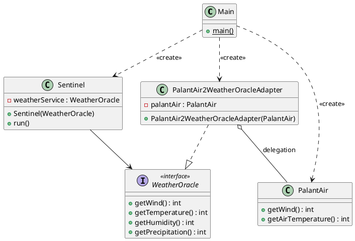

## Das Liskov Substitution Principle

Elon Bezos hat sich einen Urlaub auf seiner neusten Sommerinsel gegönnt, daher gab es keine weiteren Anforderungen
seinerseits. Das bedeutet, Sie können sich nun an den Austausch des Wetterservices machen, wofür Sie die ganze
Applikation entsprechend der bereits bekannten SOLID-Prinzipien, nämlich dem Single-Responsibility-Principle, dem
Dependency-Inversion-Principle und dem Open-Closed-Principle, angepasst haben.

### Aufgabe

Der Plan ist einfach:

1. Der neue Wetterdienst PalantAir muss als ManagedDependency in die Root-POM aufgenommen werden.
2. Danach muss die Dependency in der Modul-POM eingebunden werden.
3. Composition Root muss den neuen Wetterservice instanziieren und in den Sentinel geben.

Das alles soll ohne Anpassung im Sentinel-Sourcecode möglich sein (entsprechend des Open-Closed-Prinzips).

**Machen Sie es so!**

### Lösungsvorschlag

Die Lösung findet sich in Modul `version5`. Die ersten beiden Schritte sind trivial:

Einbindung des PalantAir in die Root-POM als Managed Dependency:

```xml
<?xml version="1.0" encoding="UTF-8"?>
<project xmlns="http://maven.apache.org/POM/4.0.0"
         xmlns:xsi="http://www.w3.org/2001/XMLSchema-instance"
         xsi:schemaLocation="http://maven.apache.org/POM/4.0.0 http://maven.apache.org/xsd/maven-4.0.0.xsd">
    <modelVersion>4.0.0</modelVersion>

    <groupId>atdit_2026.amazing.weather.sentinel</groupId>
    <artifactId>AmazingWeatherSentinel</artifactId>
    <version>1.0-SNAPSHOT</version>
    <packaging>pom</packaging>

    [...]
    <dependencyManagement>
        <dependencies>
            [...]
            <dependency>
                <groupId>atdit_2026.palantair</groupId>
                <artifactId>PalantAir</artifactId>
                <version>1.0.0</version>
            </dependency>
        </dependencies>
    </dependencyManagement>

</project>
```

Und die Einbindung in der modulspezifischen POM:

```xml
<?xml version="1.0" encoding="UTF-8"?>
<project xmlns="http://maven.apache.org/POM/4.0.0"
         xmlns:xsi="http://www.w3.org/2001/XMLSchema-instance"
         xsi:schemaLocation="http://maven.apache.org/POM/4.0.0 http://maven.apache.org/xsd/maven-4.0.0.xsd">
    <modelVersion>4.0.0</modelVersion>
    <parent>
        <groupId>atdit_2026.amazing.weather.sentinel</groupId>
        <artifactId>AmazingWeatherSentinel</artifactId>
        <version>1.0-SNAPSHOT</version>
    </parent>

    <artifactId>version5</artifactId>
    [...]

    <dependencies>
        [...]
        <dependency>
            <groupId>atdit_2026.palantair</groupId>
            <artifactId>PalantAir</artifactId>
        </dependency>
    </dependencies>
</project>
```

Der dritte Schritt wird etwas komplexer, denn wir stellen schnell fest, dass wir zwar die Implementierung des PalantAir
problemlos über eine mitglieferte Factory bekommen können, diese aber gar nicht in den Sentinel übergeben können, weil
er eine anderen Typ erwartet, nämlich ein WeatherOracle. Wir haben aber einen PalantAir. Wir müssen den PalantAir also
an die WeatherOracle-Schnittstelle anpassen oder eben adaptieren. Das induziert die Lösungsstrategie: Ein Adapter,
ähnlich wie beim Ladekabeln, der etwa USB-A nach USB-C adaptiert. Als nahmen wählen wir
`PalantAir2WeatherOracleAdapter`. Dieser Adapter muss die Schnittstelle des WeatherOracles implementieren, womit er
kompatibel ist und vom Sentinel benutzt werden kann. Aber intern leitet der Adapter alle Anfragen an die
WeatherOracle-Schnittstelle einfach an eine PalantAir-Implementierung weiter. Das nennt sich Delegation. Die originale
PalantAir-Implementierung wird dem Adapter per Constructor-Injection entsprechend des Dependency-Invesion-Prinzips
eingeimpft. Die Lösung ist also eine Kombination aus Adapter und Delegator, zwei wohlbekannten und oft benutzten Design
Patterns, die zum Werkzeugsatz einen halbwegs brauchbaren Entwickler gehören sollten.

Im Ergebnis sieht das dann so aus.

```java
public class PalantAir2WeatherOracleAdapter implements WeatherOracle {
  private final PalantAir palantAir;

  public PalantAir2WeatherOracleAdapter( PalantAir palantAir ) {
    this.palantAir = palantAir;
  }

  @Override
  public int getTemperature( ) {
    return palantAir.getAirTemperature( );
  }

  @Override
  public int getWind( ) {
    return palantAir.getWind( );
  }

  @Override
  public int getHumidity( ) {
    throw new UnsupportedOperationException( "Humidity is not supported" );
  }

  @Override
  public int getPrecipitation( ) {
    throw new UnsupportedOperationException( "Precipitation is not supported" );
  }
}
```

Aber der Adapter hat zwei Probleme, nämlich die Methoden getHumidity und getPrecipitation, die beide vom WeatherOracle
bereitgestellt werden, aber nicht vom PalantAir. Damit wir die Lösung zunächst zum LAufen bringen, machen wir daraus das
Problem unserer zukünftigen selbsts und vertagen dieses. Keine Sorge, die Besprechung ist ist der Hauptteil dieses
Kapitels. Für den Moment begüngen wir uns mit einer UnsupportedOperationException.

Der PalantAir kann mithilfe des Adapters an den Sentinel angeschlossen werden und wir können Punkt 3 der
Lösungsstrategie umsetzen und den Composition Root, also die Main-Klasse, anpassen:

```java
public class Main {
  private static final Logger log = LoggerFactory.getLogger( MethodHandles.lookup( ).lookupClass( ) );

  static void main( ) {
    log.info( "Starting Amazing Weather Sentinel" );

    //PalantAir-Instanz erzeugen
    PalantAirFactory palantAirFactory = new ProductivePalantAirFactory( );
    PalantAir palantAir = palantAirFactory.getInstance( );
    //PalantAir-nach-WeatherOracle-Adapter erzeugen
    WeatherOracle palantAir2WeatherOracleAdapter = new PalantAir2WeatherOracleAdapter( palantAir );

    //Adapter an den Sentinel übergeben
    var sentinel = new Sentinel(
      palantAir2WeatherOracleAdapter,
      new TrayReport( ),
      List.of( ) );
    sentinel.run( );
  }
}
```

Im auf das Wesentliche reduzierte Klassendiagramm wird die Verbindung der Klassen und Schnittstellen klarer. Der
Sentinel ist nicht verändert worden und arbeitet nun mit einem Adapter. Davon weiß er aber nichts, denn er "denkt", es
sei ein WeatherOracle.



