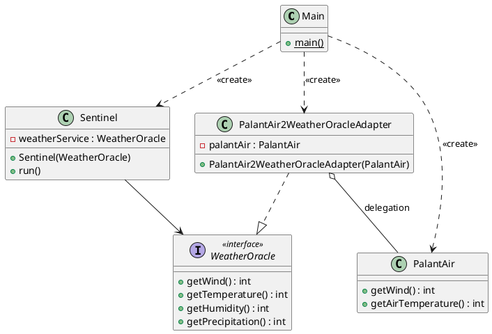
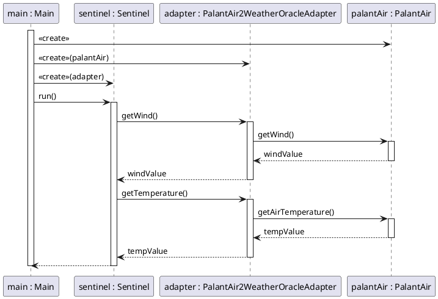

## Das Liskov Substitution Principle

Elon Bezos hat sich einen Urlaub auf seiner neuesten Sommerinsel gegönnt, daher gab es keine weiteren Anforderungen
seinerseits. Das bedeutet, Sie können sich nun an den Austausch des Wetterservices machen, wofür Sie die ganze
Applikation entsprechend der bereits bekannten SOLID-Prinzipien, nämlich dem Single-Responsibility-Prinzip, dem
Dependency-Inversion-Prinzip und dem Open-Closed-Prinzip, angepasst haben.

### Aufgabe

Der Plan ist einfach:

1. Der neue Wetterdienst PalantAir muss als ManagedDependency in die Root-POM aufgenommen werden.
2. Danach muss die Dependency in der Modul-POM eingebunden werden.
3. Composition Root muss den neuen Wetterservice instanziieren und in den Sentinel geben.

Das alles soll ohne Anpassung im Sentinel-Sourcecode möglich sein (entsprechend dem Open-Closed-Prinzip).

**Machen Sie es so!**

### Lösungsvorschlag

Die Lösung findet sich in Modul `version5`. Die ersten beiden Schritte sind trivial:

Einbindung des PalantAir in die Root-POM als Managed Dependency:

```xml
<?xml version="1.0" encoding="UTF-8"?>
<project xmlns="[http://maven.apache.org/POM/4.0.0](http://maven.apache.org/POM/4.0.0)"
         xmlns:xsi="[http://www.w3.org/2001/XMLSchema-instance](http://www.w3.org/2001/XMLSchema-instance)"
         xsi:schemaLocation="[http://maven.apache.org/POM/4.0.0](http://maven.apache.org/POM/4.0.0) [http://maven.apache.org/xsd/maven-4.0.0.xsd](http://maven.apache.org/xsd/maven-4.0.0.xsd)">
    <modelVersion>4.0.0</modelVersion>

    <groupId>atdit_2026.amazing.weather.sentinel</groupId>
    <artifactId>AmazingWeatherSentinel</artifactId>
    <version>1.0-SNAPSHOT</version>
    <packaging>pom</packaging>

    [...]
    <dependencyManagement>
        <dependencies>
            [...]
            <dependency>
                <groupId>atdit_2026.palantair</groupId>
                <artifactId>PalantAir</artifactId>
                <version>1.0.0</version>
            </dependency>
        </dependencies>
    </dependencyManagement>

</project>
```

Und die Einbindung in der modulspezifischen POM:

```xml
<?xml version="1.0" encoding="UTF-8"?>
<project xmlns="[http://maven.apache.org/POM/4.0.0](http://maven.apache.org/POM/4.0.0)"
         xmlns:xsi="[http://www.w3.org/2001/XMLSchema-instance](http://www.w3.org/2001/XMLSchema-instance)"
         xsi:schemaLocation="[http://maven.apache.org/POM/4.0.0](http://maven.apache.org/POM/4.0.0) [http://maven.apache.org/xsd/maven-4.0.0.xsd](http://maven.apache.org/xsd/maven-4.0.0.xsd)">
    <modelVersion>4.0.0</modelVersion>
    <parent>
        <groupId>atdit_2026.amazing.weather.sentinel</groupId>
        <artifactId>AmazingWeatherSentinel</artifactId>
        <version>1.0-SNAPSHOT</version>
    </parent>

    <artifactId>version5</artifactId>
    [...]

    <dependencies>
        [...]
        <dependency>
            <groupId>atdit_2026.palantair</groupId>
            <artifactId>PalantAir</artifactId>
        </dependency>
    </dependencies>
</project>
```

Der dritte Schritt wird etwas komplexer, denn wir stellen schnell fest, dass wir zwar die Implementierung des PalantAir
problemlos über eine mitgelieferte Factory bekommen können, diese aber gar nicht in den Sentinel übergeben können, weil
er einen anderen Typ erwartet, nämlich ein WeatherOracle. Wir haben aber einen PalantAir. Wir müssen den PalantAir also
an die WeatherOracle-Schnittstelle anpassen oder eben adaptieren. Das induziert die Lösungsstrategie: Ein Adapter,
ähnlich wie bei Ladekabeln, der etwa USB-A nach USB-C adaptiert. Als Name wählen wir
`PalantAir2WeatherOracleAdapter`. Dieser Adapter muss die Schnittstelle des WeatherOracles implementieren, womit er
kompatibel ist und vom Sentinel benutzt werden kann. Aber intern leitet der Adapter alle Anfragen an die
WeatherOracle-Schnittstelle einfach an eine PalantAir-Implementierung weiter. Das nennt sich Delegation. Die originale
PalantAir-Implementierung wird dem Adapter per Constructor-Injection entsprechend dem Dependency-Inversion-Prinzip
eingeimpft. Die Lösung ist also eine Kombination aus Adapter und Delegator, zwei wohlbekannten und oft benutzten Design
Patterns, die zum Werkzeugsatz eines halbwegs brauchbaren Entwicklers gehören sollten.

Im auf das Wesentliche reduzierte Klassendiagramm wird das Konzept deutlicher und dass der Adapter als Mittler zwischen
der erwarteten Schnittstelle und der andersgearteten Implementierung (dem Palantir) agiert.



Implementiert in Java sieht das wie folgt aus:

```java
public class PalantAir2WeatherOracleAdapter implements WeatherOracle {
  private final PalantAir palantAir;

  public PalantAir2WeatherOracleAdapter( PalantAir palantAir ) {
    this.palantAir = palantAir;
  }

  @Override
  public int getTemperature( ) {
    return palantAir.getAirTemperature( );
  }

  @Override
  public int getWind( ) {
    return palantAir.getWind( );
  }

  @Override
  public int getHumidity( ) {
    throw new UnsupportedOperationException( "Humidity is not supported" );
  }

  @Override
  public int getPrecipitation( ) {
    throw new UnsupportedOperationException( "Precipitation is not supported" );
  }
}
```

Aber der Adapter hat offenbar zwei Probleme, nämlich die Methoden getHumidity und getPrecipitation, die beide vom
WeatherOracle bereitgestellt werden, aber nicht vom PalantAir. Damit wir die Lösung zunächst zum Laufen bringen, machen
wir daraus das Problem unseres zukünftigen Selbst und vertagen dieses. Keine Sorge, die Besprechung ist der
Hauptteil dieses Kapitels. Für den Moment begnügen wir uns mit einer UnsupportedOperationException.

Der PalantAir kann mithilfe des Adapters an den Sentinel angeschlossen werden und wir können Punkt 3 der
Lösungsstrategie umsetzen und den Composition Root, also die Main-Klasse, anpassen:

```java
public class Main {
  private static final Logger log = LoggerFactory.getLogger( MethodHandles.lookup( ).lookupClass( ) );

  static void main( ) {
    log.info( "Starting Amazing Weather Sentinel" );

    //PalantAir-Instanz erzeugen
    PalantAirFactory palantAirFactory = new ProductivePalantAirFactory( );
    PalantAir palantAir = palantAirFactory.getInstance( );
    //PalantAir-nach-WeatherOracle-Adapter erzeugen
    WeatherOracle palantAir2WeatherOracleAdapter = new PalantAir2WeatherOracleAdapter( palantAir );

    //Adapter an den Sentinel übergeben
    var sentinel = new Sentinel(
      palantAir2WeatherOracleAdapter,
      new TrayReport( ),
      List.of( ) );
    sentinel.run( );
  }
}
```

Letztlich malen wir dazu noch ein Sequenzdiagramm, um den Delegationsfluss besser aufzuzeigen:



### Das Problem mit der Austauschbarkeit

Um nun langsam zum Hauptteil des Kapitels überzuleiten, müssen wir uns den Adapter noch einmal anschauen. Was macht der
noch einmal? Genau, er implementiert die WeatherOracle-Schnittstelle, aber eben nicht vollständig. Zwei Methoden können
aktuell nicht benutzt werden, denn ihre Benutzung würde zu einer RuntimeException führen, die, nicht abgefangen, im
Programmabbruch münden würde. Sie könnte auch nicht abgefangen werden, da der Benutzer (der Sentinel in dem Fall) gar
nicht erwartet, dass eine Exception geworfen werden könnte, wenn er das WeatherOracle doch entsprechend seines Vertrages
benutzt. Und genau deshalb ist dies ein Verstoß gegen das Liskovsche Substitutionsprinzip:

Benannt wurde das Prinzip nach Barbara Liskov, Berkeley-Absolventin, eine der ersten weiblichen Doktoren der
Informatik (Stanford), Professorin am MIT und Turingpreisträgerin, die es 1987 zuerst formulierte. Formal besagt es:
Eine Funktion, die Objekte eines Typs T verwendet, muss auch mit Objekten eines Typs S korrekt funktionieren, wenn S ein
Subtyp von T ist. Das bedeutet, dass die Eigenschaften, die für alle Objekte vom Typ T gelten, auch für alle Objekte vom
Typ S gelten müssen. Vereinfacht ausgedrückt: Eine Unterklasse muss die Basisklasse „ersetzen“ können, ohne dass der
Programmablauf durch unerwartetes Verhalten, Fehler oder veränderte Logik gestört wird. Ein Verwender darf nicht merken,
dass er statt des Originals eine spezialisierte Variante vor sich hat. Selbiges gilt für Schnittstellen und ihre
Implementierungen (faktisch vollabstrakte Klassen und Subklassen), die eben gerade T und S darstellen würden. Sehr
einfach ausgedrückt, stellt das Liskovsche Substitutionsprinzip sicher, dass die Implementierungen den Vertrag der
Schnittstellen erfüllen.

Das LSP stellt Anforderungen syntaktischer (an die Signaturen) und verhaltenstechnischer Art.

1. Signaturbedingungen:
    1. Kontravarianz bei Eingabewerten    
       Die Parameter der Methode in der Unterklasse müssen kontravariant sein (entgegen der Vererbungslinie). Das
       bedeutet:
       Die Unterklasse darf allgemeinere (oder gleiche) Parametertypen akzeptieren als die Basisklasse. Konkreter: Wenn
       die Basisklasse einen Integer erwartet, darf die Subklasse eine Number erwarten, aber z.B. keinen Double. Dem
       Client, der einen Integer übergibt, wie es die Basisklasse vorsieht, wird es weiterhin funktionieren, unabhängig
       davon, welche Subklasse letztlich die konkrete Implementierung stellt. Bei einem übergebenen Double wäre das
       nicht der Fall.
    2. Kovarianz bei Rückgabewerten  
       Die Rückgabewerte einer Methode in der Unterklasse müssen kovariant sein (entsprechend der Vererbungslinie).
       Das bedeutet: Die Unterklasse darf einen spezifischeren (oder gleichen) Rückgabetyp liefern als die Basisklasse.
       Konkreter: Wenn die Basisklasse eine Number liefert, darf die konkrete Implementierung auch einen Integer
       zurückliefern oder einen Double, aber auf keinen Fall ein Objekt. Der Client, der aufgrund des Vertrags eine
       Number erwartet, kann dann sowohl mit Number, Integer und Double umgehen, aber nicht mit einem Objekt, das die
       Eigenschaften der Number nicht erfüllt. Das gilt entsprechend auch für Exceptions!
    3. Keine neuen Ausnahmen  
       Die Unterklasse darf keine neuen Ausnahmen werfen, außer sie sind kovariant mit bereits in der Methode des
       Basistyps definierten Ausnahmen. Wenn eine Methode eine IOException wirft, darf die Subklasse problemlos eine
       FileNotFoundException werfen, die eine Subklasse der IOException ist. Sie könnte aber nicht problemlos eine
       Exception (Basisklasse der IOException) oder eine Exception anderen Typs werfen.
2. Verhaltenstechnische Bedingungen:
    1. Vorbedingungen dürfen vom Untertyp nicht verschärft werden  
       Wenn der Basistyp eine Methode hat, die einen signed Integer erwartet, also auch Negativzahlen zulässt, darf die
       Subklasse diese nicht ausschließen.
    2. Nachbedingungen dürfen nicht abgeschwächt werden  
       Wenn eine Methode eine gewisse Statusänderung an einem Objekt durchführt, die auf eine bestimmte Menge von Status
       begrenzt ist, darf eine Unterklasse nicht einen neuen Status erzeugen, da dieser Status undefiniert und vom
       Client höchstwahrscheinlich nicht erwartet oder behandelt werden kann.
    3. Invarianten dürfen vom Subtyp nicht abgeschwächt werden  
       Bedeutet, dass eine Subklasse die logischen Grundregeln der Basisklasse akzeptieren und befolgen muss. Hierfür
       gibt es ein Lehrbuchbeispiel: In der Geometrie ist ein Quadrat eine besondere Form des Rechtecks. In der
       Informatik eventuell nicht, insbesondere dann, wenn die Seitenlängen angepasst werden können. Im Rechteck ist die
       Erwartung, dass sich entweder Länge oder Breite ändern lassen, und zwar unabhängig voneinander. Im Quadrat
       bedingt
       die Änderung des einen Werts automatisch das Nachziehen des anderen.

**Wo liegt nun also das Problem mit dem Adapter und der WeatherOracle-Schnittstelle?**

Signaturbedingt wird eine neue Exception geworfen, allerdings handelt es sich um eine UncheckedException, also eine
Laufzeitausnahme. Diese kann grundsätzlich von allen Methoden geworfen werden, wie eine NullPointerException. Ein
Verstoß gegen die Signatur liegt hier also formal nicht vor.  
Jedoch liegt der Verstoß im Verhalten. Dem Sentinel wird versprochen, dass er einen Wetterservice übergeben bekommt, der
genau vier Daten liefern kann: Temperatur, Windgeschwindigkeit, Niederschlag und Luftfeuchtigkeit. Durch die Nutzung des
PalantAir-Services ist dieser Vertrag nicht mehr erfüllt; stattdessen wird eine Exception geworfen, wenn
Luftfeuchtigkeit oder Niederschlag abgefragt werden. Das bedeutet, die Klasse bzw. die beiden Methoden erzeugen einen
Status, mit dem der Client nicht rechnet. Damit handelt es sich um eine Abschwächung der Nachbedingungen. Denn anstelle
des Versprechens der Schnittstelle "Du bekommst eine Zahl" sagt der Adapter "Du bekommst eine Zahl - oder auch nicht".

Rein pragmatisch kann man hier mit diesem Verhalten leben, da wir volle Kontrolle über die gesamte Applikation haben.
Wir können also wissen, was zu erwarten ist und darauf irgendwie reagieren. Ein von Pragmatismus geprägter Ansatz. So
lang nicht eine Anforderung von Elon Bezos gestellt wird, dass die Luftfeuchtigkeit oder Niederschlag berücksichtigt
wird, gibt es kein Problem. Falls er doch irgendwann damit um die Ecke kommt, ist PalantAir nicht länger geeignet als
Wetterservice der Wahl.
In der Realität ist ein solch pragmatischer Ansatz oft nicht der Fall, insbesondere bei vielen möglichen
Implementierungen zu einer Schnittstelle (nehmen wir SLF4J als Beispiel). Hier muss sichergestellt werden, dass auch das
Liskov-Prinzip angewendet wird.

Eine Lösung für unser Problem erfordert leider ein erneutes und dann auch letztes Aufbohren der Applikation: Die
Schnittstelle muss spezifischer werden, das heißt schmaler. Und das machen wir unter Betrachtung des
Interface-Segregation-Prinzips, das wir uns im nächsten Kapitel vornehmen.

p.s. Ein weiteres Problem der aktuellen Applikation ist natürlich der Aufbau auf dem WeatherOracle, eine Bibliothek, die
Elon Bezos nicht bezahlen will. Das bedeutet in aller Regel aber auch, dass er sie nicht weiter verwenden darf. Doch
genau das ist in der aktuellen Sentinel-Implementierung der Fall: Die Schnittstelle WeatherOracle ist bei uns verbaut,
ein potenziell kostspieliger Designfehler. Glücklicherweise können wir die Abhängigkeit nach der nächsten Änderung auch
entsorgen.

[Inhalt](../script.md) | [Nächstes Kapitel](90_isp.md)