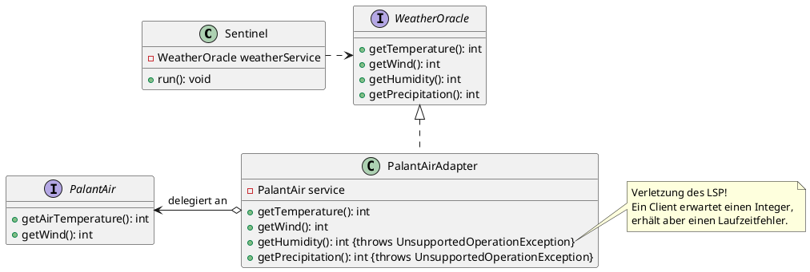
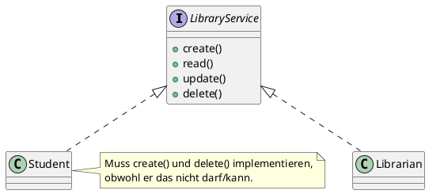
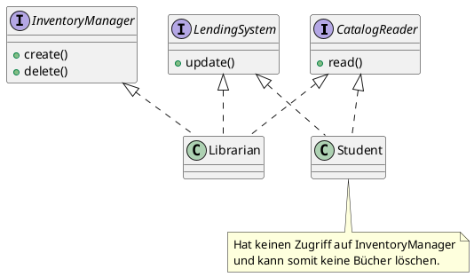

## Das Interface Segregation Principle

Im letzten Kapitel sind wir zu dem Schluss gekommen, dass das aktuelle Design der Anwendung gegen das Liskov
Substitution Principle verstößt. Als Lösung des spezifischen Problems wurde das Interface Segregation Principle genannt.
Bevor wir zur Erklärung kommen, rekapitulieren wir noch einmal das Problem:

Wir haben den Wetterdienst `WeatherOracle` durch den Wetterdienst `PalantAir` ersetzt, aber der
`Amazing Weather Sentinel` arbeitet intern weiter auf der `WeatherOracle`-Schnittstelle. Deshalb haben wir einen Adapter
geschrieben, der die `PalantAir`-Schnittstelle auf die Schnittstelle `WeatherOracle` abbildet. Aber der `PalantAir` kann
nicht sämtliche Daten liefern, die das `WeatherOracle` liefern kann. Als Folge können einige Methoden nicht konform zum
Liskovschen Substitutionsprinzip implementiert werden.

Da der `PalantAir`-Service die Funktionalität nicht bieten kann, ist es keine Option, diese zu implementieren. Das wäre
auch gar nicht nötig, denn der derzeit einzige Client, der `Sentinel`, benötigt die beiden Methoden ja gar nicht. Der
Fehler liegt tatsächlich in der Nutzung der Schnittstelle `WeatherOracle`, die größer ist, als zur Umsetzung der
Anforderungen des `Amazing Weather Sentinels` nötig. Und noch dazu verwenden wir die Bibliothek damit trotzdem, obwohl
sie ja entfernt werden soll, weil sie zahlungspflichtig geworden ist.

Wir müssen die Schnittstelle also ersetzen. Und hier kommt das Interface Segregation Principle ins Spiel. Es besagt,
frei nach Robert C. Martin, dass Clients nicht dazu gezwungen werden sollten, von Schnittstellen abhängig zu sein, die
sie gar nicht nutzen. Das heißt, eine Schnittstelle sollte so geschnitten (no pun intended) sein, dass sie genau eine
Rolle oder einen Verwendungszweck abbildet. Hier gibt es einen direkten Bezug zum Single Responsibility Principle, denn
wenn ein Interface zu viele unterschiedliche Funktionen anbietet, werden die implementierenden Klassen gezwungen, alle
diese Funktionen zur Verfügung zu stellen.

Gehen wir von einer Schnittstelle aus, die `CRUD`-Funktionen (`Create`, `Read`, `Update` und `Delete`) für bestimmte
Entitäten anbietet, etwa für die Verwaltung der Bibliothek an der Hochschule. Ein Bibliothekar oder eine Bibliothekarin
muss

- neue Bücher in den Katalog aufnehmen können (`Create`),
- verlorengegangene Bücher ausbuchen (`Delete`),
- eine Leihe oder Rückgabe buchen (`Update`) und natürlich
- im Katalog suchen (`Read`) können.

Studierende können per Webanwendung auf dieselbe Datenbasis zugreifen, werden aber in aller Regel nur eine
Suchfunktion (`Read`) und ggf. eine Reservierungsoption (`Update`), mit einiger Sicherheit aber keine Anlege- oder
Löschfunktion haben. Die Webanwendung wäre trotzdem gezwungen, diese Methoden bereitzustellen, vielleicht über denselben
Service sogar, was bei schludriger Implementierung sogar eine Sicherheitslücke darstellen kann, da Studierende dann ggf.
Bücher ausleihen und sie anschließend aus dem System löschen könnten, um sie für immer zu behalten.

Anstatt also Clients zu zwingen, Methoden zu implementieren, die sie gar nicht benötigen, sollte man ein einzelnes,
großes Interface in mehrere, spezialisiertere Schnittstellen zerteilen. So kann man die Funktionalität, die Klassen
anbieten müssen, auf jene beschränken, die tatsächlich benötigt werden. Dies führt zwar nicht automatisch, aber
zumindest mit größerer Wahrscheinlichkeit zu einer Einhaltung des Single Responsibility Principles und hilft, Verstöße
gegen die Liskov-Regeln zu vermeiden.

Und genau dasselbe Prinzip wenden wir auch auf den `Amazing Weather Sentinel` an.

### Aufgabe

Wenden Sie Interface Segregation an, um den LSP-Versoß im `Amazing Weather Sentinel` zu beheben. Beachten Sie dabei
sämtliche SOLID-Prinzipien.

### Lösungsvorschlag

Die Lösung finden Sie in Modul `version6`. Wie kommen wir zu dieser Lösung?

1. Die Abhängigkeit zu WeatherOracle ist zu entfernen. Dazu sind drei Schritte nötig:
    1. Entfernen Sie die Dependency aus der `pom.xml` des Moduls `version6`.
    2. Entfernen Sie die Dependency aus dem DependencyManagement in der Root `pom.xml`.
    3. Der Adapter `PalantAir2WeatherOracleAdapter` ist obsolet und kann gelöscht werden.
2. Es werden Schnittstellen für einen TemperatureProvider und einen WindSpeedProvider benötigt. Als Rückgabewert
   benutzen wir pragmatischerweise `ìnt`.
3. Ein neuer Adapter wird benötigt, der den PalantAir auf die beiden neuen Schnittstellen abbildet. Wichtig ist, dass
   der Adapter beide Schnittstellen implementiert. Damit ist das LSP-Problem gelöst, da wir die zuvor überschüssigen
   Methoden `getHumidity( ) : int` und `getPrecipitation( ) : int` gar nicht mehr im Code haben.
4. Der `Sentinel` übernimmt aber nicht den Adapter, sondern erwartet jetzt zwei Parameter. Sonst erstellen wir eine
   Abhängigkeit zwischen `Sentinel` und dem *konkreten* Adapter, ein Verstoß gegen das Dependency Inversion Principle.
5. Im Composition Root, der `Main`-Klasse wird die Anwendung orchestriert.
6. Der Unittest muss noch entsprechend angepasst werden.

Damit ist nun auch das letzte Problem des `Amazing Weather Sentinels` behoben. Alle fünd SOLID-Prinzipien sind
implementiert. Herzlichen Glückwunsch, wenn Sie das zukünftig ebenso anwenden, bekommen Sie mit Sicherheit nicht nur
einen Obstkorb von Elon Bezos zum Dank, sondern erhalten wahrscheinlich auch die volle Punktzahl für den
Entwicklungsteil im Projekt für Aktuelle Themen der IT 2.