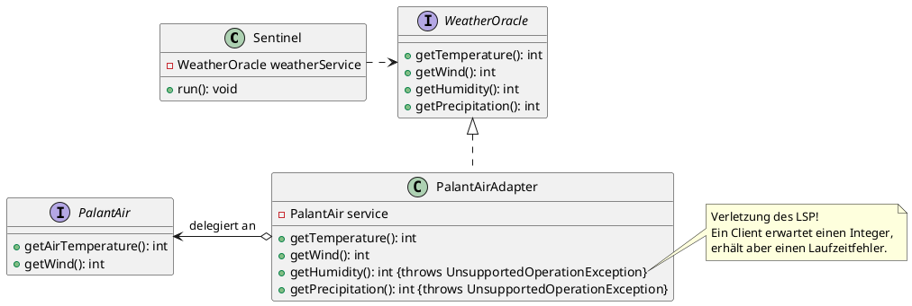
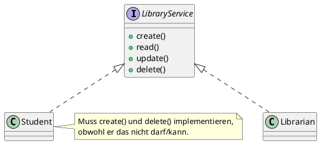
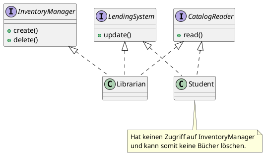
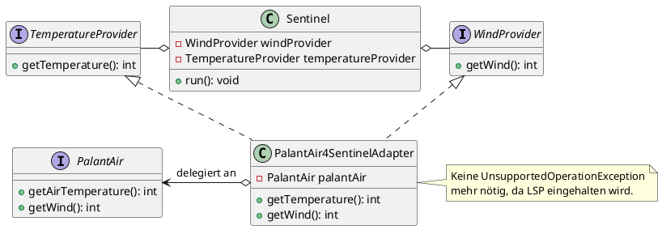

## Das Interface Segregation Principle

Im letzten Kapitel sind wir zu dem Schluss gekommen, dass das aktuelle Design der Anwendung gegen das Liskov
Substitution Principle verstößt. Als Lösung des spezifischen Problems wurde das Interface Segregation Principle genannt.
Bevor wir zur Erklärung kommen, rekapitulieren wir noch einmal das Problem:

Wir haben den Wetterdienst `WeatherOracle` durch den Wetterdienst `PalantAir` ersetzt, aber der
`Amazing Weather Sentinel` arbeitet intern weiter auf der `WeatherOracle`-Schnittstelle. Deshalb haben wir einen Adapter
geschrieben, der die `PalantAir`-Schnittstelle auf die Schnittstelle `WeatherOracle` abbildet. Aber der `PalantAir` kann
nicht sämtliche Daten liefern, die das `WeatherOracle` liefern kann. Als Folge können einige Methoden nicht konform zum
Liskovschen Substitutionsprinzip implementiert werden.



Da der `PalantAir`-Service die Funktionalität nicht bieten kann, ist es keine Option, diese zu implementieren. Das wäre
auch gar nicht nötig, denn der derzeit einzige Client, der `Sentinel`, benötigt die beiden Methoden ja gar nicht. Der
Fehler liegt tatsächlich in der Nutzung der Schnittstelle `WeatherOracle`, die größer ist, als zur Umsetzung der
Anforderungen des `Amazing Weather Sentinels` nötig. Und noch dazu verwenden wir die Bibliothek damit trotzdem, obwohl
sie ja entfernt werden soll, weil sie zahlungspflichtig geworden ist.

Wir müssen die Schnittstelle also ersetzen. Und hier kommt das Interface Segregation Principle ins Spiel. Es besagt,
frei nach Robert C. Martin, dass Clients nicht dazu gezwungen werden sollten, von Schnittstellen abhängig zu sein, die
sie gar nicht nutzen. Das heißt, eine Schnittstelle sollte so geschnitten (no pun intended) sein, dass sie genau eine
Rolle oder einen Verwendungszweck abbildet. Hier gibt es einen direkten Bezug zum Single Responsibility Principle, denn
wenn ein Interface zu viele unterschiedliche Funktionen anbietet, werden die implementierenden Klassen gezwungen, alle
diese Funktionen zur Verfügung zu stellen.

Gehen wir von einer Schnittstelle aus, die `CRUD`-Funktionen (`Create`, `Read`, `Update` und `Delete`) für bestimmte
Entitäten anbietet, etwa für die Verwaltung der Bibliothek an der Hochschule. Ein Bibliothekar oder eine Bibliothekarin
muss:

- neue Bücher in den Katalog aufnehmen können (`Create`),
- verloren gegangene Bücher ausbuchen (`Delete`),
- eine Leihe oder Rückgabe buchen (`Update`) und natürlich
- im Katalog suchen (`Read`) können.

Studierende können per Webanwendung auf dieselbe Datenbasis zugreifen, werden aber in aller Regel nur eine
Suchfunktion (`Read`) und ggf. eine Reservierungsoption (`Update`), mit einiger Sicherheit aber keine Anlege- oder
Löschfunktion haben. Die Webanwendung wäre trotzdem gezwungen, diese Methoden bereitzustellen, vielleicht über denselben
Service sogar, was bei schludriger Implementierung sogar eine Sicherheitslücke darstellen kann, da Studierende dann ggf.
Bücher ausleihen und sie anschließend aus dem System löschen könnten, um sie für immer zu behalten.



Anstatt also Clients zu zwingen, Methoden zu implementieren, die sie gar nicht benötigen, sollte man ein einzelnes,
großes Interface in mehrere, spezialisiertere Schnittstellen zerteilen. So kann man die Funktionalität, die Klassen
anbieten müssen, auf jene beschränken, die tatsächlich benötigt werden. Dies führt zwar nicht automatisch, aber
zumindest mit größerer Wahrscheinlichkeit zu einer Einhaltung des Single Responsibility Principles und hilft, Verstöße
gegen die Liskov-Regeln zu vermeiden.



Und genau dasselbe Prinzip wenden wir auch auf den `Amazing Weather Sentinel` an.

### Aufgabe

Wenden Sie Interface Segregation an, um den LSP-Verstoß im `Amazing Weather Sentinel` zu beheben. Beachten Sie dabei
sämtliche SOLID-Prinzipien.

### Lösungsvorschlag

Die Lösung finden Sie in Modul `version6`. Wie kommen wir zu dieser Lösung?

Die Abhängigkeit zu `WeatherOracle` ist zu entfernen. Dazu entfernen wir zunächst die Dependency aus der `pom.xml` des
Moduls `version6` aus der Dependency-Sektion. Damit wird auch der `PalantAir2WeatherOracleAdapter` obsolet. Löschen Sie
diesen.

Sie benötigen eine neue Schnittstelle, die die Funktionen des Wetterservices abbildet. Es wäre prinzipiell ausreichend,
die Interfacesegregation nur bis zum kleinsten gemeinsamen Nenner zu treiben, das heißt, nur eine Schnittstelle zu
erstellen, die zwei Methoden enthält, nämlich `getWind() : int` und `getTemperature() : int`. Da diese Methoden aber nur
eine leichte Kohäsion aufweisen, spricht nichts dagegen, beide Methoden in einzelne Interfaces auszulagern. Das hat den
schönen Nebeneffekt, dass die Interfaces funktional eingesetzt werden können (Lambda-Ausdrücke, Methodenreferenzen), da
sie nur eine Methode haben. Relevanter Mehraufwand ist nicht vorhanden, weswegen hier auch kein Yagni-Verstoß
vorliegt.  
Erstellen Sie also diese Schnittstellen `WindProvider` und `TemperatureProvider`. Verfallen Sie nicht der Versuchung,
beiden Interfaces die Methode `get` zu geben, sondern seien Sie spezifischer mit dem Namen (`getWind`,
`getTemperature`). Die Erklärung folgt gleich. Als Rückgabeparameter können Sie pragmatischerweise `int` benutzen.

```java
public interface WindProvider {
    int getWind();
}
```

```java
public interface TemperatureProvider {
    int getTemperature();
}
```

Der `PalantAir` implementiert diese Schnittstellen von Haus aus nicht, daher benötigen wir erneut einen Adapter.
Erstellen Sie die Klasse `PalantAir4SentinelAdapter` und lassen Sie sie beide neuen Schnittstellen implementieren. Hier
wird klar, warum eine Methode `get` nicht spezifisch genug gewesen wäre. Bei der Implementierung der beiden
Schnittstellen im Adapter käme es zu einer Signaturkollision, die letztlich in einer einzigen Methode in der
implementierenden Klasse münden würde. Der Adapter wüsste dann nicht, ob er die Temperatur oder die Windgeschwindigkeit
liefern sollte. Zum Glück sind die Methodennamen aber mit Voraussicht gewählt worden.  
Benutzen Sie für die Implementierung des Adapters wieder das Delegationsprinzip, diesmal aber zu einem `PalantAir`.
Dabei sollte Ihnen auffallen, dass bei der Implementierung keine `UnsupportedOperationException` mehr nötig ist. Der
Verstoß gegen das LSP ist also aufgelöst.

```java
public class PalantAir4SentinelAdapter implements WindProvider, TemperatureProvider {
    private final PalantAir palantair;

    public PalantAir4SentinelAdapter(PalantAir palantAir) {
        this.palantair = palantAir;
    }

    @Override
    public int getTemperature() {
        return palantair.getAirTemperature();
    }

    @Override
    public int getWind() {
        return palantair.getWind();
    }
}
```

Der `Sentinel` muss leider noch ein letztes Mal angepasst werden. Er erwartet ja eigentlich noch ein `WeatherOracle`,
wir haben aber nur einen `TemperatureProvider` und einen `WindProvider` (ganz zu schweigen davon, dass das
`WeatherOracle` im ganzen Programm nicht mehr bekannt ist, weil wir die Abhängigkeit verbannt haben).  
Prinzipiell hätten wir dem `Sentinel` auch noch den Adapter anzubieten, jedoch würde das zu einer Kopplung zwischen
`Sentinel` und dem (konkreten) Adapter führen, was ein Verstoß gegen das Dependency-Inversion-Prinzip darstellte.  
Der `Sentinel` bekommt also die beiden Schnittstellen, folglich muss er auf deren Benutzung vorbereitet werden. Dazu
muss er vom Konstruktor je eine Instanz der beiden Schnittstellen entgegennehmen und sich diese merken. Darüber hinaus
muss beim Vorbereiten der `WeatherParameters` noch die Abfrage auf Wind und Temperatur entsprechend umgeleitet werden.

```java
public class Sentinel {
    private static final Logger log = LoggerFactory.getLogger(MethodHandles.lookup().lookupClass());
    private final WindProvider windProvider;
    private final TemperatureProvider temperatureProvider;
    private final WeatherReport weatherReport;
    private final List<WeatherCheck> weatherChecks;

    public Sentinel(WindProvider windProvider, TemperatureProvider temperatureProvider,
                    WeatherReport weatherReport, List<WeatherCheck> weatherChecks) {
        this.windProvider = windProvider;
        this.temperatureProvider = temperatureProvider;
        this.weatherReport = weatherReport;
        this.weatherChecks = weatherChecks;
    }

    public void run() {
        log.debug("Creating Weather Report");
        var weather = new WeatherCheck.WeatherParameters(
                windProvider.getWind(),
                temperatureProvider.getTemperature());
        var message = executeWeatherChecks(weather);
        weatherReport.report(message);
    }

    private String executeWeatherChecks(WeatherCheck.WeatherParameters weather) {
        List<String> results = new LinkedList<>();
        for (var wc : weatherChecks) {
            var checkResult = wc.check(weather);
            results.add(checkResult);
        }
        return String.join(System.lineSeparator(), results);
    }
}
```

Letztlich muss noch der Composition Root, also die `Main`-Klasse, die Anwendung neu orchestrieren. Sie erstellt
(weiterhin) eine Instanz des `PalantAir` über die mitgelieferte Fabrik, erstellt dann eine Instanz des neuen
`PalantAir4SentinelAdapter`s und instanziiert zuletzt den `Sentinel` unter Berücksichtigung der neuen
Constructor-Signatur.

```java
public class Main {
    private static final Logger log = LoggerFactory.getLogger(MethodHandles.lookup().lookupClass());

    static void main() {
        log.info("Starting Amazing Weather Sentinel");

        // PalantAir-Instanz erzeugen
        PalantAirFactory palantAirFactory = new ProductivePalantAirFactory();
        PalantAir palantAir = palantAirFactory.getInstance();

        // Neuen Adapter für den Sentinel erzeugen
        var weatherServiceAdapter = new PalantAir4SentinelAdapter(palantAir);

        // Adapter an den Sentinel übergeben
        var sentinel = new Sentinel(
                weatherServiceAdapter,
                weatherServiceAdapter,
                new TrayReport(),
                List.of(new WindCheck(), new TemperatureCheck(), new WindAndFrostCheck()));
        sentinel.run();
    }
}
```

Das Gesamtergebnis dieser Änderung sieht, in einem auf das Wesentliche reduzierte Klassendiagram veranschaulicht, wie
folgt aus:



Dass der vorangegangene Absatz mit "letztlich" begonnen hat, war eine Lüge. Zwar ist die Anpassung abgeschlossen, aber
der
Unittest muss noch korrigiert werden: Der `weatherOracleStub` entfällt. An seine Stelle treten zwei lokale
Implementierungen der neuen Schnittstellen `WindProvider` und `TemperatureProvider`. Hier können wir uns den oben
bereits angepriesenen Vorteil der funktionalen Interfaces zunutze machen und uns Boilerplate-Code sparen, indem die
Schnittstellenimplementierungen durch Lambdas realisiert werden. Das ist elegant und wird möglich, weil die
Implementierungen lediglich Stubs sind, die nur einen Wert zurückliefern. Komplexere Konstrukte, wie Spys, wären auch
möglich, aber der Lesbarkeit des Codes nicht zuträglich.

```java
public class SentinelTest {
    @Test
    void verifySentinelOrchestration() {
        // assemble
        // Festwerte und Doubles definieren
        final var weatherParameters = new WeatherCheck.WeatherParameters(60, 17);
        final String message = "XXX";
        final String expectedMessage = message + System.lineSeparator() + message;

        // erstellen eines Spys für WeatherCheck, der den empfangenen Windwert protokolliert
        // und die oben definierte *message* zurückliefert
        class WeatherCheckSpy implements WeatherCheck {
            private WeatherParameters receivedWeatherParameters;

            @Override
            public String check(WeatherParameters weatherParameters) {
                receivedWeatherParameters = weatherParameters;
                return message;
            }
        }
        var weatherCheckSpy1 = new WeatherCheckSpy();
        var weatherCheckSpy2 = new WeatherCheckSpy();

        // erstellen eines Spys für WeatherReport, der die empfangene Nachricht protokolliert
        var weatherReportSpy = new WeatherReport() {
            private String receivedMessage;

            @Override
            public void report(String msg) {
                receivedMessage = msg;
            }
        };

        // act
        // einen Sentinel mit den Doubles erstellen und laufen lassen
        var cut = new Sentinel(
                () -> weatherParameters.wind().intValue(), // Lambda-Implementierung für den WindProviderStub
                () -> weatherParameters.temperature().intValue(), // Lambda-Implementierung für den TemperatureProviderStub
                weatherReportSpy,
                List.of(weatherCheckSpy1, weatherCheckSpy2));
        cut.run();

        // assert
        // die protokollierten Werte müssen den definierten Festwerten entsprechen
        Assertions.assertEquals(weatherParameters, weatherCheckSpy1.receivedWeatherParameters);
        Assertions.assertEquals(weatherParameters, weatherCheckSpy2.receivedWeatherParameters);
        Assertions.assertEquals(expectedMessage, weatherReportSpy.receivedMessage);
    }
}
```

Damit ist nun auch das letzte SOLID-Problem des `Amazing Weather Sentinels` behoben. Alle fünf SOLID-Prinzipien sind
implementiert. Herzlichen Glückwunsch, wenn Sie das zukünftig ebenso anwenden, bekommen Sie mit Sicherheit nicht nur
einen Obstkorb von Elon Bezos zum Dank, sondern erhalten wahrscheinlich auch die volle Punktzahl für den
Entwicklungsteil im Projekt für Aktuelle Themen der IT 2.